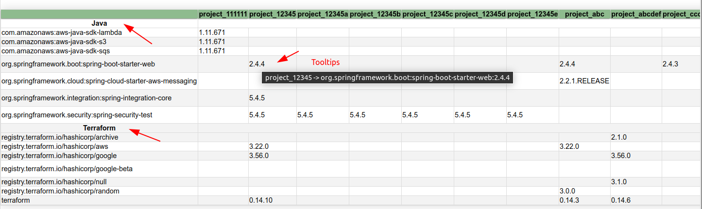
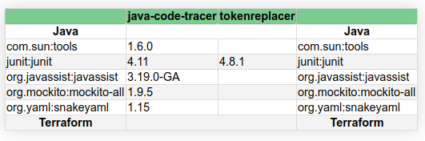

# What

This tool is a _very_ naive approach to analyzing a projects dependencies. It uses native tools like maven, gradle, terraform and some shell tricks to do the job (instead of real parsers).
In order for the tool to be runnable you need to execute it on a machine that has the necessary tools installed (if your project is using the tools).
At the moment to following dependency types are supported: 

- maven
- gradle 
- terraform

What you'll need to run the report (installed on the machine where the report is generated.
This could also be a github action runner in a pipeline which should have all the tools needed.

- *nix system
- maven (if it's maven project)
- gradle (if it's gradle project)
- terraform (if your project is using terraform)
- a personal github access token to clone the repositories (which are potentially in private org repos)
  - see [config sample](./.dependency_report_sample) for details
- python > 3.8 (for the report generation)

The result will be a single page HTML report that looks like this:



or matching the [config sample](./.dependency_report_sample)



Do yourself a favour and use something like [Dependabot](https://github.com/dependabot) :)

# How / Setup

```
# 1. clone repo
$ git clone dependency_report
$ cd dependency_report

# 2. copy sample config and change values yourself
$ cp .dependency_report_sample ~/.dependency_report

# 3. generate report
make report

# 4. check the generated report
```

# Process

The Tool runs in two steps:

1. Generate intermediate csv report for each dependency type
2. Generate single HTML report page

```
# beware: directories depend on your config!
$ cd dependency_report
$ ~/dependency_report: ls -al
drwxrwxr-x   4 user user 4096 Apr 14 11:29 .
drwxr-xr-x 106 user user 4096 Apr 14 11:29 ..
drwxrwxr-x   2 user user 4096 Apr 14 11:22 report  <- html report
drwxrwxr-x   2 user user 4096 Apr 14 11:22 results <- intermediate csv
```
